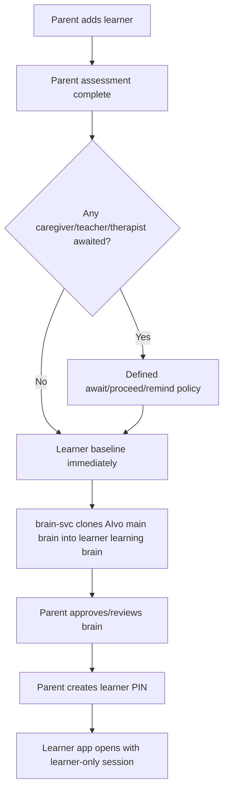
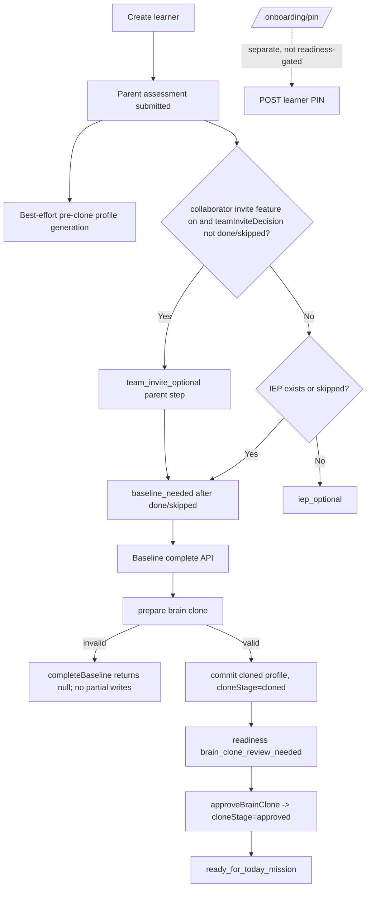

# AIvo Multi-App, RBAC & Onboarding-Flow Audit

**Date:** 2026-06-13  
**Scope:** `apps/web-v2`, `apps/mobile`, `services/identity-svc`, relevant BFF/data-layer code, and prior `aivo-assessment-ux-report.md`.  
**Method:** Code-evidence audit only. I did not run the web/mobile apps or walk live flows; no screenshots were taken. Every behavioral claim below is tied to real code evidence. Claims I could not verify are marked **❓ Unverified**.

> **Constraint note:** The requested artifact is this single report file. No product fixes were implemented.

---

## 1. Executive summary

| Pillar | Verdict | Why |
|---|---:|---|
| App topology | 🟡 Partial | Web and mobile both have learner, parent, teacher, therapist, and caregiver route groups, and web role homes enumerate those five roles. However, several mobile/web surfaces are shallow shells, and web login does not present a learner/adult toggle. Evidence: `apps/web-v2/lib/auth/types.ts:3`, `apps/web-v2/lib/auth/types.ts:57`, `apps/mobile/app/(caregiver)/index.tsx`, route tree found by `find apps/web-v2/app apps/mobile/app -maxdepth 3 -type f`. |
| RBAC / caregiver grant | 🟡 Partial with 🚨 IDOR risk | Roles are centralized in web-v2, page guards exist, and caregiver grants are represented as care-team invite records scoped by learner/tenant. But the generic learner-scope guard allows every non-parent/non-learner role with same-tenant learner existence, not teacher/caregiver/therapist membership; that is an IDOR class for any endpoint relying only on `requireLearnerScope`. Evidence: `apps/web-v2/lib/bff/guards.ts:57`, `apps/web-v2/lib/bff/guards.ts:87`, `apps/web-v2/lib/db/team-invites.ts:23`, `apps/web-v2/lib/db/team-invites.ts:95`, `apps/web-v2/lib/db/team-invites.ts:223`. |
| Onboarding state machine | 🟡 Partial | Readiness is derived from persisted records and routes parent assessment → optional team invite/IEP → baseline → brain clone review → ready mission. It is not the intended sequence: the contributor branch is an optional invite-decision step, not an awaited-contributor state machine; PIN creation is a separate onboarding page that is not gated by clone completion or approval. Evidence: `apps/web-v2/lib/learner/readiness.ts:116`, `apps/web-v2/lib/learner/readiness.ts:128`, `apps/web-v2/lib/learner/readiness.ts:148`, `apps/web-v2/lib/learner/readiness.ts:154`, `apps/web-v2/app/onboarding/pin/page.tsx:30`, `apps/web-v2/app/onboarding/pin/page.tsx:96`. |
| Learner-PIN auth | 🔴 Broken / insecure in current service path | Mobile has a PIN login path and identity-svc mints learner sessions from PIN. But web login lacks the specified toggle; identity-svc stores and compares learner PINs in plaintext (`users.pin`), finds learners by parent then `users.pin = pin`, and the mobile UI only displays local attempt errors without proven server lockout. Evidence: `apps/web-v2/app/login/_components/login-form.tsx:68`, `apps/web-v2/app/login/_components/login-form.tsx:70`, `apps/mobile/app/(auth)/login.tsx:317`, `apps/mobile/app/(auth)/pin.tsx:70`, `services/identity-svc/src/routes/auth.ts:1064`, `services/identity-svc/src/routes/auth.ts:1112`, `services/identity-svc/src/routes/auth.ts:1122`, `services/identity-svc/src/routes/users.ts:360`. |

### Single most important finding

The **brain approval vs. learner access** story is now split:

* The teaching path is correctly gated in `createLessonRun`: it refuses to generate lessons unless `brain.cloneStage === "approved"`. Evidence: `apps/web-v2/lib/db/repos.ts:2753`, `apps/web-v2/lib/db/repos.ts:2757`.
* But **PIN creation is not gated on clone completion or approval** and can be completed/ skipped from `/onboarding/pin` with only a learner selection and a 4-digit match. Evidence: `apps/web-v2/app/onboarding/pin/page.tsx:62`, `apps/web-v2/app/onboarding/pin/page.tsx:92`, `apps/web-v2/app/onboarding/pin/page.tsx:96`, `apps/web-v2/app/onboarding/pin/page.tsx:102`.

So the highest-priority product gap is not currently “unapproved brain teaches lessons” in web-v2 lesson creation; it is that **the learner app can be opened/authenticated before the parent has completed the trust ceremony**, while lesson-start APIs later fail with `brain_not_approved`. That creates a confusing child-facing dead end and must be closed by making approval (or an explicit “PIN creation is approval” product decision) a server-side precondition for PIN activation and learner app entry.

---

## 2. Intended vs. actual onboarding flow

### Intended flow

### Actual verified web-v2 flow

### Divergences

1. **Contributor awaited branch is undefined as an await policy.** The code has an optional team invite step controlled by `teamInviteDecision`; once parent chooses done/skipped, readiness proceeds to baseline. It does not wait for invited contributors to submit. Evidence: `apps/web-v2/lib/learner/readiness.ts:148`, `apps/web-v2/lib/learner/readiness.ts:154`, `apps/web-v2/lib/learner/readiness.ts:156`.
2. **Brain cloning is web-v2 internal, not a verified `brain-svc` call in this path.** `completeBaseline` prepares and commits a brain clone in `apps/web-v2/lib/db/repos.ts`; comments say it mirrors `brain-svc`, but the route calls `completeBaseline` directly. Evidence: `apps/web-v2/app/api/bff/learners/[learnerId]/baseline/[baselineId]/complete/route.ts:7`, `apps/web-v2/app/api/bff/learners/[learnerId]/baseline/[baselineId]/complete/route.ts:35`, `apps/web-v2/lib/db/repos.ts:2253`.
3. **PIN creation is not sequenced after clone completion/approval.** `/onboarding/pin` posts directly to `/api/bff/learners/:learnerId/pin` and then routes to parent verification, not learner app opening. Evidence: `apps/web-v2/app/onboarding/pin/page.tsx:30`, `apps/web-v2/app/onboarding/pin/page.tsx:32`, `apps/web-v2/app/onboarding/pin/page.tsx:102`, `apps/web-v2/app/onboarding/pin/page.tsx:103`.
4. **Approval gate is enforced for lessons, but not for PIN activation.** Lesson creation refuses unapproved brains; PIN creation only checks parent role and learner scope. Evidence: `apps/web-v2/lib/db/repos.ts:2753`, `apps/web-v2/lib/db/repos.ts:2757`, `apps/web-v2/app/api/bff/learners/[learnerId]/pin/route.ts:22`, `apps/web-v2/app/api/bff/learners/[learnerId]/pin/route.ts:26`, `apps/web-v2/app/api/bff/learners/[learnerId]/pin/route.ts:63`.

---

## 3. Capability matrix

| Area | Component | Status | Evidence |
|---|---|---:|---|
| A | Web learner sub-app | ✅ | `ROLE_HOME.learner` points to `/learner/home`. `apps/web-v2/lib/auth/types.ts:57`, `apps/web-v2/lib/auth/types.ts:59`. |
| A | Web parent sub-app | ✅ | `ROLE_HOME.parent` points to `/parent/home`. `apps/web-v2/lib/auth/types.ts:57`, `apps/web-v2/lib/auth/types.ts:58`. |
| A | Web teacher sub-app | ✅ | `ROLE_HOME.teacher` points to `/teacher/home`. `apps/web-v2/lib/auth/types.ts:57`, `apps/web-v2/lib/auth/types.ts:60`. |
| A | Web therapist sub-app | ✅ | `ROLE_HOME.therapist` points to `/therapist/home`. `apps/web-v2/lib/auth/types.ts:57`, `apps/web-v2/lib/auth/types.ts:62`. |
| A | Web caregiver sub-app | 🟡 | `ROLE_HOME.caregiver` exists and caregiver pages call `requirePageRole(["caregiver", "platform_admin"])`; surface is narrower than parent but heavily observation/caseload oriented. `apps/web-v2/lib/auth/types.ts:61`, `apps/web-v2/app/caregiver/observations/page.tsx:63`, `apps/web-v2/app/caregiver/observations/page.tsx:64`. |
| A | Mobile five sub-app route groups | 🟡 | Route files exist for `(learner)`, `(parent)`, `(teacher)`, `(therapist)`, `(caregiver)` from route-tree command; depth/functionality varies. Example route files: `apps/mobile/app/(caregiver)/index.tsx`, `apps/mobile/app/(therapist)/index.tsx`, `apps/mobile/app/(teacher)/index.tsx`. |
| B | Central role model | ✅ | Web-v2 `Role` union includes learner/parent/teacher/caregiver/therapist plus admin/support roles. `apps/web-v2/lib/auth/types.ts:3`, `apps/web-v2/lib/auth/types.ts:16`. |
| B | Page-level auth | ✅ | `requirePageRole` redirects unauthenticated to `/login` and wrong-role users to their own role home. `apps/web-v2/lib/auth/server.ts:12`, `apps/web-v2/lib/auth/server.ts:18`, `apps/web-v2/lib/auth/server.ts:21`. |
| B | Server-side BFF role guard | ✅ | `requireRole` rejects sessions whose active role is not in the allowed set. `apps/web-v2/lib/bff/guards.ts:18`, `apps/web-v2/lib/bff/guards.ts:19`. |
| B | Child-scoped learner guard | 🟡 / 🚨 | Parents and learners are scoped, but all other roles pass if the learner exists in the same tenant. This is insufficient for caregiver/teacher/therapist grants. `apps/web-v2/lib/bff/guards.ts:69`, `apps/web-v2/lib/bff/guards.ts:78`, `apps/web-v2/lib/bff/guards.ts:87`. |
| B | Caregiver grant storage | ✅ | Care-team records include `learnerId`, `tenantId`, role, email, member user, status, relationship, and seat limits. `apps/web-v2/lib/db/team-invites.ts:23`, `apps/web-v2/lib/db/team-invites.ts:27`, `apps/web-v2/lib/db/team-invites.ts:56`, `apps/web-v2/lib/db/team-invites.ts:115`. |
| B | Caregiver grant enforcement | 🟡 | Caregiver pages list learner IDs through accepted care-team membership; generic BFF guard does not enforce caregiver membership on every child-scoped route. `apps/web-v2/lib/db/team-invites.ts:223`, `apps/web-v2/lib/db/team-invites.ts:230`, `apps/web-v2/lib/bff/guards.ts:87`. |
| C | Real onboarding state persistence | 🟡 | `computeReadinessFor` derives state from learner, parent assessment, IEP, baseline, lesson count, and brain profile. It is a derived state/cache, not a strict transition ledger. `apps/web-v2/lib/learner/readiness.ts:108`, `apps/web-v2/lib/learner/readiness.ts:116`. |
| C | Add learner → assessment | 🟡 | Readiness falls back to `profile_created`; partial assessment becomes `assessment_needed`. `apps/web-v2/lib/learner/readiness.ts:159`, `apps/web-v2/lib/learner/readiness.ts:162`. |
| C | Parent assessment → branch | 🟡 | Submitted assessment checks optional team invite decision and IEP decision; no awaited contributor policy exists. `apps/web-v2/lib/learner/readiness.ts:148`, `apps/web-v2/lib/learner/readiness.ts:154`, `apps/web-v2/lib/learner/readiness.ts:156`. |
| C | Baseline legal transition enforcement | ❓ | Baseline complete route authorizes session/scope/consent and validates baseline learner ID, but this audit did not verify that baseline creation/start is impossible before submitted parent assessment. Evidence found for completion path only. `apps/web-v2/app/api/bff/learners/[learnerId]/baseline/[baselineId]/complete/route.ts:18`, `apps/web-v2/app/api/bff/learners/[learnerId]/baseline/[baselineId]/complete/route.ts:27`, `apps/web-v2/app/api/bff/learners/[learnerId]/baseline/[baselineId]/complete/route.ts:31`. |
| D | Clone trigger | ✅ | Baseline completion prepares clone before mutations, commits clone, then writes completed baseline. `apps/web-v2/lib/db/repos.ts:2253`, `apps/web-v2/lib/db/repos.ts:2258`, `apps/web-v2/lib/db/repos.ts:2282`, `apps/web-v2/lib/db/repos.ts:2284`. |
| D | Clone failure behavior | ✅ | If clone prep fails, `completeBaseline` returns `null` before derived artifacts/status writes. `apps/web-v2/lib/db/repos.ts:2253`, `apps/web-v2/lib/db/repos.ts:2258`, `apps/web-v2/lib/db/repos.ts:2261`. |
| D | Approval gate for teaching | ✅ | `createLessonRun` checks brain exists and `cloneStage === "approved"` before lesson generation and snapshots brain state. `apps/web-v2/lib/db/repos.ts:2745`, `apps/web-v2/lib/db/repos.ts:2757`, `apps/web-v2/lib/db/repos.ts:2816`. |
| E | Parent creates PIN | 🟡 | Web onboarding page collects 4 digits and posts to BFF; BFF requires parent role + learner scope. Not gated on clone/approval. `apps/web-v2/app/onboarding/pin/page.tsx:32`, `apps/web-v2/app/api/bff/learners/[learnerId]/pin/route.ts:22`, `apps/web-v2/app/api/bff/learners/[learnerId]/pin/route.ts:26`. |
| E | PIN hashed at rest | 🔴 | Web mock store hashes with scrypt, but identity-svc user creation stores `pin: body.pin`, and PIN login queries `users.pin = pin`. `apps/web-v2/lib/db/learner-pin-store.ts:1`, `apps/web-v2/lib/db/learner-pin-store.ts:16`, `services/identity-svc/src/routes/users.ts:360`, `services/identity-svc/src/routes/auth.ts:1112`. |
| E | PIN rate limit/lockout | 🔴 / ❓ | Mobile counts attempts locally only; identity-svc PIN route shown has no rate-limit/lockout code in the verified block. `apps/mobile/app/(auth)/pin.tsx:43`, `apps/mobile/app/(auth)/pin.tsx:75`, `services/identity-svc/src/routes/auth.ts:1064`. |
| E | Learner session scoping | 🟡 | Identity-svc mints a learner access token from matched learner user; web-v2 sessions include optional `learnerId` and learner scope checks use it. ❓ JWT claim mapping to `session.learnerId` for PIN sessions was not fully verified. `services/identity-svc/src/routes/auth.ts:1122`, `apps/web-v2/lib/auth/types.ts:32`, `apps/web-v2/lib/bff/guards.ts:78`. |
| F | Web login toggle | ⬜ | Web login renders adult email/password form with hidden role `parent`; no learner PIN toggle found in the login form. `apps/web-v2/app/login/_components/login-form.tsx:68`, `apps/web-v2/app/login/_components/login-form.tsx:70`. |
| F | Mobile login toggle | 🟡 | Mobile adult login includes a learner PIN button to `/learner-login`; this is more link than toggle but distinct path exists. `apps/mobile/app/(auth)/login.tsx:317`, `apps/mobile/app/(auth)/login.tsx:319`, `apps/mobile/app/(auth)/login.tsx:323`. |
| F | Adult role routing | 🟡 | Web redirects adult users to `ROLE_HOME[profile.role]`; mobile `router.replace("/")` depends on app root/session routing not fully audited. `apps/web-v2/app/login/page.tsx:99`, `apps/web-v2/app/login/page.tsx:100`, `apps/mobile/hooks/useAuth.ts:188`, `apps/mobile/hooks/useAuth.ts:191`. |

---

## 4. Gap report

### 🚨 Gap 1 — Learner PINs are plaintext in identity-svc

**What is broken:** identity-svc creates learner users with `pin: body.pin` and PIN login queries `users.pin = pin`. That means the production service path treats the learner PIN as a plaintext credential. Evidence: `services/identity-svc/src/routes/users.ts:360`, `services/identity-svc/src/routes/auth.ts:1112`, `services/identity-svc/src/routes/auth.ts:1115`.

**Root cause:** The web mock fallback was hardened with scrypt, but identity-svc never received equivalent credential storage and verification semantics. Evidence of hardened mock-only path: `apps/web-v2/lib/db/learner-pin-store.ts:16`, `apps/web-v2/lib/db/learner-pin-store.ts:35`.

### 🚨 Gap 2 — Child-scoped IDOR risk for non-parent roles

**What is broken:** `requireLearnerScope` validates parent relationship and learner self-scope, but for teacher/caregiver/therapist/admin-like roles it only checks that the learner exists in the same tenant. Any BFF route that allows `teacher`, `caregiver`, or `therapist` and relies on this guard risks same-tenant cross-child access. Evidence: `apps/web-v2/lib/bff/guards.ts:57`, `apps/web-v2/lib/bff/guards.ts:69`, `apps/web-v2/lib/bff/guards.ts:78`, `apps/web-v2/lib/bff/guards.ts:87`.

**Root cause:** Role membership checks exist elsewhere (`listLearnersForMember`) but are not centralized into the generic learner scope guard. Evidence: `apps/web-v2/lib/db/team-invites.ts:223`, `apps/web-v2/lib/db/team-invites.ts:230`.

### ⚠️ Gap 3 — PIN creation is not tied to clone completion or parent approval

**What is broken:** `/onboarding/pin` can create a PIN whenever the parent can select a learner and the PIN matches locally; the BFF only checks parent ownership. It does not check `brainProfile.cloneStage === "approved"`. Evidence: `apps/web-v2/app/onboarding/pin/page.tsx:92`, `apps/web-v2/app/onboarding/pin/page.tsx:96`, `apps/web-v2/app/api/bff/learners/[learnerId]/pin/route.ts:22`, `apps/web-v2/app/api/bff/learners/[learnerId]/pin/route.ts:63`.

**Root cause:** PIN setup is a generic onboarding page with `NEXT_STEP = "/onboarding/parent-verify"`, not a learner-readiness transition after brain approval. Evidence: `apps/web-v2/app/onboarding/pin/page.tsx:30`, `apps/web-v2/app/onboarding/pin/page.tsx:103`.

### ⚠️ Gap 4 — Contributor-awaited branch is a product and state-machine gap

**What is broken:** The intended branch asks what happens if caregiver/teacher/therapist is awaited. Current code only checks whether the parent has decided the optional invite step (`done` or `skipped`). It does not represent awaited contributors, submission deadlines, reminders, or a proceed-without-input policy. Evidence: `apps/web-v2/lib/learner/readiness.ts:148`, `apps/web-v2/lib/learner/readiness.ts:154`, `apps/web-v2/lib/learner/readiness.ts:156`.

**Root cause:** Onboarding is derived from records and route decisions, not modeled as an explicit state machine with transition events and contributor sub-states. Evidence: `apps/web-v2/lib/learner/readiness.ts:108`, `apps/web-v2/lib/learner/readiness.ts:116`.

### ⚠️ Gap 5 — Web login lacks the specified learner/adult toggle

**What is broken:** Web `/login` is adult email/password/SSO only; the form includes a hidden `role=parent` and no learner PIN branch. Evidence: `apps/web-v2/app/login/_components/login-form.tsx:68`, `apps/web-v2/app/login/_components/login-form.tsx:70`.

**Root cause:** Learner PIN auth was implemented in mobile and identity-svc, but not exposed as a first-class web login mode.

### ⚠️ Gap 6 — Mobile PIN flow does not bind selected learner in the PIN login request

**What is broken:** `learner-login` can route to `/pin?parentId=…&learnerId=…`, but `PinScreen` ignores `learnerId` when calling `loginWithPin`; identity-svc searches all children for that parent and matches any learner with that PIN. Evidence: `apps/mobile/app/(auth)/learner-login.tsx:80`, `apps/mobile/app/(auth)/pin.tsx:38`, `apps/mobile/app/(auth)/pin.tsx:70`, `apps/mobile/hooks/useAuth.ts:211`, `services/identity-svc/src/routes/auth.ts:1105`, `services/identity-svc/src/routes/auth.ts:1116`.

**Root cause:** PIN auth API contract requires only `parentId` and `pin`, not `learnerId`. Evidence: `services/identity-svc/src/routes/auth.ts:1069`, `services/identity-svc/src/routes/auth.ts:1071`.

---

## 5. Detailed remediation guide

### Remediation 1 — Replace plaintext learner PINs with hashed, learner-scoped credentials

**Build:**
1. Add `learner_pin_credentials` or equivalent columns (`pin_hash`, `pin_salt`/argon parameters, `pin_set_at`, `failed_attempts`, `locked_until`, `updated_at`) in the identity data model. Do not reuse `users.pin` except as a deprecated migration source.
2. In `services/identity-svc/src/routes/users.ts`, replace `pin: body.pin` with a call to a new `setLearnerPin(db, learnerUserId, rawPin)` service using Argon2id or scrypt.
3. In `services/identity-svc/src/routes/auth.ts`, change `/api/auth/pin-login` to require `{ parentId, learnerId, pin }`; load the learner by `parentId + learnerId`, then verify the hash with constant-time/Argon2 verification.
4. Add server-side lockout: e.g., 5 failed attempts per `(parentId, learnerId, device fingerprint/IP bucket)` in 10 minutes locks for 15 minutes. Return 429 with seconds remaining.
5. Remove all code paths that query `users.pin = pin`. Add a migration that hashes any existing plaintext `users.pin`, then nulls/removes the column.
6. Update web BFF `setLearnerPinViaIdentity` to call the new identity-svc endpoint and never log raw PINs.

**Server-side enforcement:** identity-svc must own hashing, verification, lockout, audit events, and learner binding.

**Definition of done:**
* No query compares a plaintext PIN column to user input.
* Tests prove PINs are not stored as 4–6 digit plaintext, valid PIN logs in, wrong PIN increments lockout, locked PIN returns 429, and same PIN on sibling accounts cannot authenticate the wrong selected learner.

### Remediation 2 — Centralize role-aware child scope checks

**Build:**
1. Replace `requireLearnerScope` with role-specific checks:
   * parent → parent relationship.
   * learner → session learner ID only.
   * teacher → roster/classroom assignment or accepted team invite, depending endpoint domain.
   * caregiver → accepted caregiver team member for that learner.
   * therapist → accepted therapist team member for that learner.
   * admins → explicit admin permissions and tenant/school scope.
2. Add `requireCareTeamScope(session, learnerId, role)` and call it inside `requireLearnerScope` for caregiver/therapist; use `teacherCanAccessLearner` for teacher routes where school roster is the intended grant.
3. Audit every `/api/bff/**/[learnerId]/**` route for `requireRole` + `requireLearnerScope`; update expected access tests to include same-tenant non-member denials.
4. Add negative tests for caregiver/teacher/therapist same-tenant IDOR across brain profile, recommendations, baseline, lesson runs, observations, and learner context routes.

**Server-side enforcement:** BFF and microservice routes must enforce this; UI hiding is not sufficient.

**Definition of done:** A caregiver invited to learner A receives 403 for learner B in the same tenant across every child-scoped endpoint.

### Remediation 3 — Make onboarding an explicit state machine

**Build:**
1. Add an `onboarding_transitions` table and a `learner_onboarding_state` record with states such as `learner_created`, `parent_assessment_in_progress`, `parent_assessment_complete`, `contributors_pending`, `baseline_ready`, `baseline_complete`, `brain_clone_pending`, `brain_review_required`, `brain_approved`, `pin_ready`, `learner_app_open`.
2. Implement `advanceOnboarding(learnerId, event, actor)` in web-v2 or a dedicated onboarding service; reject illegal transitions with typed errors.
3. On parent assessment submission, emit `parent_assessment_submitted` and compute contributor policy. If no contributors are awaited, transition to `baseline_ready` immediately.
4. If contributors are awaited, implement the product policy chosen from the open questions: wait for all, wait until deadline, or proceed while accepting late input as future brain-change proposals.
5. Replace route-only readiness decisions with state-machine-backed redirects and BFF precondition checks.

**Definition of done:** Tests prove a learner cannot start baseline before parent assessment complete, cannot create PIN before the configured approval milestone, and contributor branches behave exactly as product specifies.

### Remediation 4 — Reconcile brain approval and learner PIN/app entry

**Build options requiring product decision:**
* **Separate approval step:** PIN creation is allowed only after `brainProfile.cloneStage === "approved"`.
* **PIN creation is approval:** The PIN screen includes final review/consent language and atomically calls `approveBrainClone` plus `set PIN` in one transaction.

**Recommended implementation:** Separate approval step.
1. Add a server-side precondition in `POST /api/bff/learners/[learnerId]/pin`: fetch brain profile and require `cloneStage === "approved"`; otherwise return 409/412 with `brain_not_approved`.
2. Move PIN CTA to the brain approval success state, not generic onboarding.
3. Change successful PIN save to route to learner app handoff (`/learner/select/auto?learnerId=...` on web; learner app home on mobile) only after session handoff is valid.
4. In mobile, hide learner profiles without active PIN/approved brain or show parent-facing setup message.
5. Add tests that unapproved cloned brain cannot create PIN, approved brain can, and lesson-start still rejects any unapproved state.

**Definition of done:** There is no path where a child enters the learner app and then immediately hits an avoidable trust-gate failure because the parent has not approved the brain.

### Remediation 5 — Implement the login toggle on web and harden mobile parity

**Build:**
1. Web `/login`: add a two-tab/toggle control: `Learner` and `Parent / teacher / therapist / caregiver`. Learner tab renders family/learner selector + PIN entry and calls a BFF proxy to identity-svc `/api/auth/pin-login`.
2. Adult tab keeps existing email/password/SSO/MFA path.
3. On mobile, convert the current “Learner PIN Login” link into the same explicit toggle affordance while preserving deep links.
4. Ensure learner sessions carry role `LEARNER`, a learner identifier claim, no adult capabilities, shorter session lifetime, and role switcher disabled.
5. Add route tests: learner token cannot reach parent/teacher/therapist/caregiver BFF routes; adult token cannot use PIN-only endpoints; wrong role redirects to `ROLE_HOME`.

**Definition of done:** Both web and mobile present the same mental model: “Learner — PIN only” vs “All other users — standard authentication.”

### Remediation 6 — Fully wire caregiver as an RBAC-restricted parent variant

**Build:**
1. Define a caregiver capability set (example: view learner schedule, add observations, view assigned child summary, receive notifications; no billing, no consent, no brain approval unless explicitly delegated, no data export/delete).
2. Store caregiver grant scope per learner and capability in the care-team member record or a new `caregiver_grants` table.
3. Enforce capabilities server-side on every caregiver route and BFF endpoint; do not rely on a separate route tree alone.
4. Make caregiver UI consume the same child-summary components as parent where appropriate but render through caregiver-scoped BFF view models that omit restricted fields.
5. Add a caregiver-vs-parent permission test matrix.

**Definition of done:** A caregiver can only act on the learner(s) and capabilities granted by the parent, and every denied parent capability returns 403 server-side.

---

## 6. Open product questions

1. **Contributor-awaited policy:** If a teacher/therapist/caregiver is invited during onboarding, should baseline wait for them, wait until a deadline, or proceed immediately while folding late input into later brain-change proposals?
2. **PIN and approval ceremony:** Is creating the learner PIN itself the parent’s approval moment, or must approval be a separate explicit review action before PIN creation?
3. **Caregiver authority:** Can caregivers ever approve low-risk brain changes (sensory/regulation) when delegated, or should parent approval always be required for the initial learning brain?
4. **Sibling PIN collisions:** Should sibling learners under one parent be required to have distinct PINs, or should the login contract always include selected `learnerId` so collisions are harmless?
5. **Mobile parity depth:** Are teacher/therapist/caregiver mobile sub-apps expected to be complete operational surfaces, or companion-lite surfaces with web as the control plane?

---

## 7. Commands used

* `find .. -name AGENTS.md -print`
* `find apps/web-v2/app apps/mobile/app -maxdepth 3 -type f | sort`
* `rg -n "learner|parent|teacher|therapist|caregiver|PIN|pin|onboard|brain|approval|RBAC|role|guardian" apps services packages --glob '!**/node_modules/**' --glob '!**/dist/**'`
* `rg -n "pin-login|loginWithPin|setLearnerPin|rate|lock|hash|bcrypt|argon|scrypt|learner.*pin" services/identity-svc apps/mobile apps/web-v2/lib/bff/identity-learners.ts --glob '!**/node_modules/**'`
* Targeted `sed` / `nl -ba` reads of the cited files.
